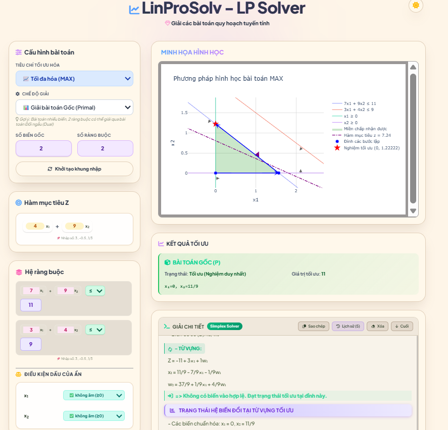
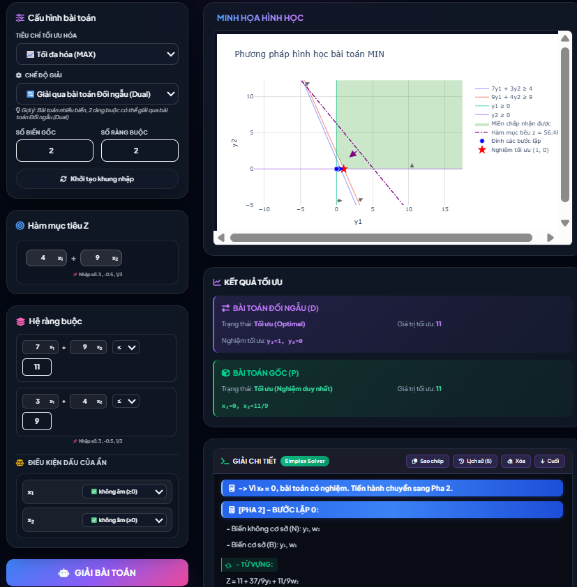

# LinProSolv — Trình giải Quy hoạch Tuyến tính

<p align="center">
  
  
  
  
</p>

<p align="center">
  <b>Ứng dụng web giải bài toán Quy hoạch Tuyến tính với độ chính xác tuyệt đối</b><br>
  Hiển thị chi tiết từng bước lặp — Đồ thị 2D — Lưu lịch sử giải
</p>

---

## 📌 Tổng quan

**LinProSolv** là một ứng dụng web toàn diện được xây dựng trên nền tảng **Flask (Python)**, cung cấp một giải pháp mạnh mẽ và trực quan cho việc giải các bài toán Quy hoạch Tuyến tính (QHTT). Với giao diện thân thiện và các thuật toán tối ưu được tích hợp sâu, người dùng có thể dễ dàng nhập bài toán, lựa chọn phương pháp giải phù hợp và nhận được kết quả chi tiết qua từng bước lặp của thuật toán.


- 🎓 **Tính sư phạm** — Giải các bài toán QHTT một cách khá chi tiết, có hiển thị từng bước lặp của thuật toán
- 🎯 **Độ chính xác tuyệt đối** — Sử dụng phân số (`Fraction`) cho mọi tính toán
- ✨ **Trải nghiệm người dùng** — Giao diện hiện đại, lưu lịch sử, sao chép log

## ✨ Tính năng nổi bật

| Nhóm tính năng | Mô tả chi tiết |
| :--- | :--- |
| 🎯 **Đa dạng bài toán** | Hỗ trợ cả bài toán **Tối đa hóa (Max)** và **Tối thiểu hóa (Min)** |
| 🔗 **Ràng buộc** | Chấp nhận đồng thời 3 loại ràng buộc: `≤`, `≥`, `=` |
| 📊 **Điều kiện biến** | Xử lý đầy đủ 3 loại biến: **Không âm** ($x \ge 0$), **Không dương** ($x \le 0$) và **Tự do** |
| ⚙️ **Phương pháp giải** | • **Đơn hình hai pha** (quy tắc Bland chống xoay vòng)<br>• **Đối ngẫu** (giải bài toán đối ngẫu, suy nghiệm gốc từ định lý độ lệch bù) |
| 🔢 **Kết quả** | Sử dụng kiểu `Fraction` cho mọi tính toán, kết quả là phân số tối giản, **không có sai số làm tròn** |
| 📝 **Quá trình giải** | Xuất chi tiết các **bảng từ vựng (Dictionary)** sau mỗi bước lặp: biến cơ sở, biến vào, biến ra, giá trị hàm mục tiêu |
| 📈 **Đồ thị** | Với bài toán 2 biến, hiển thị đồ thị **tương tác** (Plotly) bao gồm: miền khả thi, các đường ràng buộc, gradient hàm mục tiêu, điểm tối ưu và **quỹ đạo các đỉnh** mà thuật toán đã duyệt |
| 📋 **Sao chép lời giải**   | Nút **"Sao chép"** cho phép copy toàn bộ log chi tiết (các bước lặp, bảng đơn hình) vào clipboard, rất hữu ích cho việc làm báo cáo |
| 💾 **Lưu lịch sử** | Tự động lưu 5 bài toán gần nhất (đầu vào, kết quả, log) trên **localStorage của trình duyệt** theo cơ chế FIFO. Có thể tải lại bất kỳ phiên bản nào |
| 🎨 **Giao diện** | • Hiệu ứng **Glassmorphism**<br>• **Chế độ Sáng/Tối** (tự động ghi nhớ)<br>• **Responsive** (dùng tốt trên mobile)<br>• Nhập liệu linh hoạt (số nguyên, thập phân, phân số như `1/3`, `-2/5`) |

---

### Giao diện minh họa

| Chế độ Sáng | Chế độ Tối |
|:---:|:---:|
|  |  |

---
## 🛠️ Công nghệ sử dụng

### 🔧 Backend (Python)

| Công nghệ            | Vai trò                           |
| -------------------- | --------------------------------- |
| `Flask`              | `Web Framework`, định tuyến `API` |
| `fractions.Fraction` | Tính toán chính xác trên phân số  |
| `NumPy`              | Hỗ trợ tính toán ma trận          |
| `Plotly`             | Sinh đồ thị tương tác dạng `HTML` |

### 🎨 Frontend (Giao diện)

| Công nghệ           | Vai trò                                      |
| ------------------- | -------------------------------------------- |
| `Tailwind CSS`      | Thiết kế giao diện nhanh, hỗ trợ `Dark Mode` |
| `JavaScript (ES6+)` | Xử lý sự kiện, gọi `API` và cập nhật `DOM`   |
| `Font Awesome`      | Cung cấp bộ biểu tượng `vector`              |

---

## 🚀 Hướng dẫn sử dụng

Bạn có thể sử dụng ứng dụng theo **hai cách**:

### 1️⃣ Sử dụng phiên bản Web trực tuyến (Không cần cài đặt)

> 🌐 **Truy cập:** [linprosolv.onrender.com](https://linprosolv.onrender.com)

> ⚠️ **Lưu ý:** Với gói miễn phí của Render, ứng dụng có thể "ngủ" sau 15 phút không hoạt động. Lần truy cập đầu tiên sau đó có thể mất khoảng **30 giây** để hệ thống khởi động lại.

### 2️⃣ Chạy phiên bản Local (Máy tính cá nhân)

> **Yêu cầu hệ thống:** Python 3.8+ (Khuyến nghị bản 3.11)

```bash
# 1. Clone dự án
git clone https://github.com/Tranchande/linprosolv.git
cd linprosolv/linprosolv-project

# 2. Tạo và kích hoạt môi trường ảo
python -m venv venv

# Windows:
.\venv\Scripts\activate

# macOS/Linux:
source venv/bin/activate

# 3. Cài đặt thư viện
pip install -r ../requirements.txt

# 4. Khởi chạy ứng dụng
python app.py
```
👉 Mở trình duyệt: http://127.0.0.1:2026

# 📖 Hướng dẫn sử dụng

| Bước | Thao tác                                                                                                                                                                         |
| ---- | -------------------------------------------------------------------------------------------------------------------------------------------------------------------------------- |
| 1️⃣  | Chọn bài toán **Max/Min**, phương pháp giải, nhập số biến và số ràng buộc, sau đó nhấn **Khởi tạo**.                                                                             |
| 2️⃣  | Nhập các hệ số của hàm mục tiêu và các ràng buộc (hỗ trợ nhập phân số như `1/2`, `-3/4`).                                                                                        |
| 3️⃣  | Nhấn **GIẢI BÀI TOÁN** để bắt đầu tính toán.                                                                                                                                     |
| 4️⃣  | Xem kết quả:  <br>• Đồ thị trực quan (đối với bài toán 2 biến) <br>• Nghiệm tối ưu và giá trị hàm mục tiêu dưới dạng phân số <br>• Bảng đơn hình và các bước lặp chi tiết |
| 5️⃣  | Sử dụng nút **Sao chép kết quả** để lưu lời giải hoặc **Lịch sử** để tải lại các bài toán đã thực hiện.                                                                          |

---

# 📁 Cấu trúc dự án

```text
linprosolv/
├── linprosolv-project/
│   ├── app.py                 # Ứng dụng Flask chính
│   ├── solve_two_phase.py     # Thuật toán đơn hình hai pha
│   ├── duality.py             # Giải bài toán bằng phương pháp đối ngẫu
│   ├── plot_graph.py          # Vẽ đồ thị miền nghiệm khả thi
│   └── templates/
│       └── index.html         # Giao diện người dùng
├── requirements.txt           # Danh sách thư viện phụ thuộc
├── render.yaml                # Cấu hình triển khai trên Render
└── README.md                  # Tài liệu dự án
```

---

# 👥 Nhóm phát triển

| STT | MSSV     | Họ và tên             |
| --- | -------- | --------------------- |
| 1   | 23110081 | Phan Ngọc Minh Hằng   |
| 2   | 23110025 | Nguyễn Thái Đăng Khoa |
| 3   | 23110064 | Nguyễn Cao Kỳ Ân      |
| 4   | 23110124 | Trần Nguyễn Thảo Vy   |

---

# 🔗 Liên kết

🌐 Website: https://linprosolv.onrender.com

💻 GitHub: https://github.com/Tranchande/linprosolv

📦 Backup dữ liệu: Google Drive: https://drive.google.com/drive/folders/1_i3pzuUrbwVViUabZjKlX4B5V6l-pMEf?usp=drive_link
